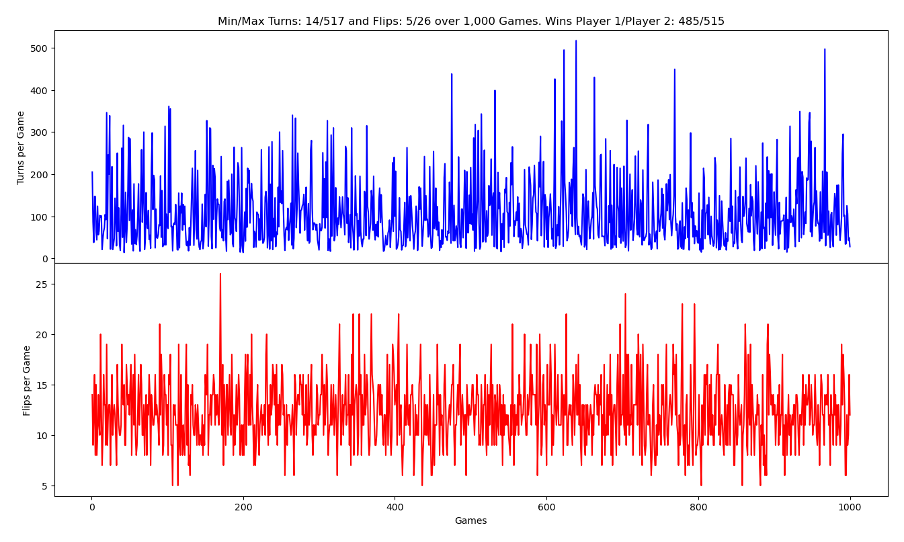
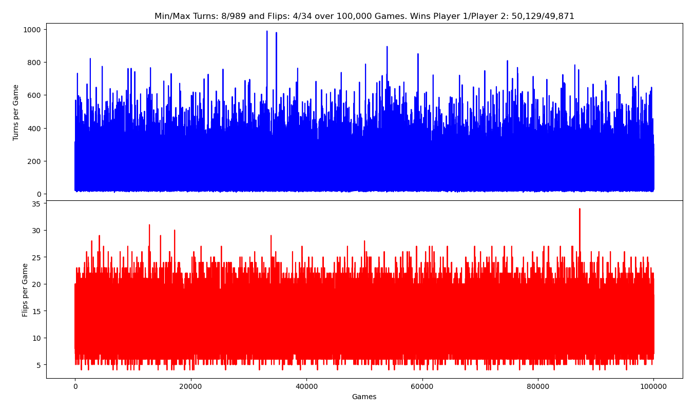
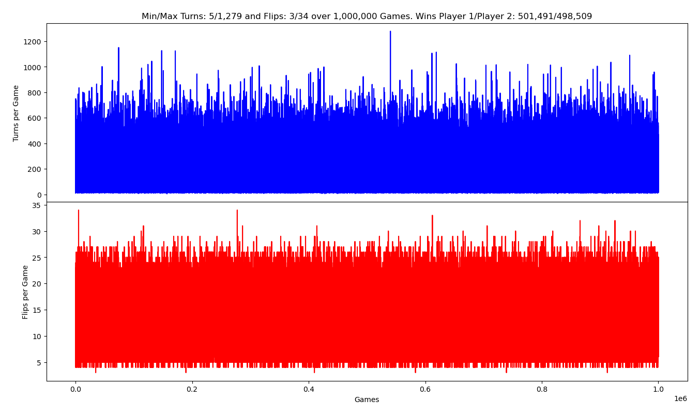

# beat-your-neighbour
Python script to simulate this 2-player card game.

This is based on:

1. The Wikipedia article:

   Beat Your Neighbour (aka Beggar my neighbour) - https://en.wikipedia.org/wiki/Beggar-my-neighbour

2. A script I wrote (byn.py) to simulate the game.

### Simulation Results

#### 1,000 Games


#### 10,000 Games


#### 100,000 Games


#### 1000,000 Games


#### The effect of changing Court Cards: JQKA vs JQK vs JQ vs J
The following table shows that with <b>less court cards</b>, the average game is longer (mean turns increases) but the flip length (mean flips) reduces.

| Court Cards | Min Turns | Max Turns  | Mean Turns | Min Flips | Max Flips | Mean Flips |
| ----------: | --------: | ---------: | ---------: | --------: | --------: | ---------: |
|        JQKA |         9 |        700 |     108.51 |         4 |        26 |      12.31 |
|        JQK  |        21 |      1,518 |     214.94 |         3 |        18 |       7.83 |
|        JQ   |        35 |      2,994 |     374.03 |         2 |         9 |       4.42 |
|        J    |        47 |      3,710 |     614.19 |         1 |         4 |       1.98 |


### Help
```
$ python byn.py -h
usage: byn.py [-h] [-n GAMES] [-c CARDS] [-d] [-l LEVEL] [-q] [-s] [-g GAME_PAUSE] [-t TURN_PAUSE]

This program simulates a 2-player game of Beat Thy Neighbour.

optional arguments:
  -h, --help            show this help message and exit
  -n GAMES, --games GAMES
                        no of games to play
  -c CARDS, --cards CARDS
                        definition of the court-cards
  -d, --debug           print some debugging output
  -l LEVEL, --level LEVEL
                        print debug level
  -q, --quiet           supress gameplay
  -s, --step            step through each turn
  -g GAME_PAUSE, --game_pause GAME_PAUSE
                        pause between each game
  -t TURN_PAUSE, --turn_pause TURN_PAUSE
                        pause between each turn
$
```

### Sample run
```
$ python byn.py
Beat Your Neighbour, 2-Player Card Game Simulation
Court cards: JQKA

Game: 1
Initial Hand1(26)
A❤️  Q♣️  Q❤️  7❤️  J❤️  7♣️  10♠️  9❤️  7♦️  4♦️  2♠️  2♦️  8♦️
K♣️  10❤️  9♠️  9♣️  A♠️  J♠️  6♠️  6♦️  2♣️  8❤️  J♦️  6♣️  5❤️

Initial Hand2(26)
A♦️  6❤️  J♣️  3♠️  K♠️  8♣️  3❤️  A♣️  3♣️  Q♠️  K♦️  Q♦️  8♠️
9♦️  2❤️  5♦️  5♠️  7♠️  4♠️  K❤️  4♣️  3♦️  10♣️  5♣️  4❤️  10♦️

Turn: 1 Player 1 plays: A❤️
Cost is 4, Player 2 paying A♦️
Cost is 4, Player 1 paying Q♣️
Cost is 2, Player 2 paying 6❤️
Cost is 2, Player 2 paying J♣️
Cost is 1, Player 1 paying Q❤️
Cost is 2, Player 2 paying 3♠️
Cost is 2, Player 2 paying K♠️
Cost is 3, Player 1 paying 7❤️
Cost is 3, Player 1 paying J❤️
Cost is 1, Player 2 paying 8♣️
Turn winner is player 1
Hand1(32)
7♣️  10♠️  9❤️  7♦️  4♦️  2♠️  2♦️  8♦️  K♣️  10❤️  9♠️  9♣️  A♠️
J♠️  6♠️  6♦️  2♣️  8❤️  J♦️  6♣️  5❤️  A❤️  A♦️  Q♣️  6❤️  J♣️
Q❤️  3♠️  K♠️  7❤️  J❤️  8♣️

Hand2(20)
3❤️  A♣️  3♣️  Q♠️  K♦️  Q♦️  8♠️  9♦️  2❤️  5♦️  5♠️  7♠️  4♠️
K❤️  4♣️  3♦️  10♣️  5♣️  4❤️  10♦️

Turn: 2 Player 1 plays: 7♣️
Pile(1)
7♣️

Hand1(31)
10♠️  9❤️  7♦️  4♦️  2♠️  2♦️  8♦️  K♣️  10❤️  9♠️  9♣️  A♠️  J♠️
6♠️  6♦️  2♣️  8❤️  J♦️  6♣️  5❤️  A❤️  A♦️  Q♣️  6❤️  J♣️  Q❤️
3♠️  K♠️  7❤️  J❤️  8♣️

Hand2(20)
3❤️  A♣️  3♣️  Q♠️  K♦️  Q♦️  8♠️  9♦️  2❤️  5♦️  5♠️  7♠️  4♠️
K❤️  4♣️  3♦️  10♣️  5♣️  4❤️  10♦️

Turn: 3 Player 2 plays: 3❤️
Pile(2)
7♣️  3❤️

Hand1(31)
10♠️  9❤️  7♦️  4♦️  2♠️  2♦️  8♦️  K♣️  10❤️  9♠️  9♣️  A♠️  J♠️
6♠️  6♦️  2♣️  8❤️  J♦️  6♣️  5❤️  A❤️  A♦️  Q♣️  6❤️  J♣️  Q❤️
3♠️  K♠️  7❤️  J❤️  8♣️

Hand2(19)
A♣️  3♣️  Q♠️  K♦️  Q♦️  8♠️  9♦️  2❤️  5♦️  5♠️  7♠️  4♠️  K❤️
4♣️  3♦️  10♣️  5♣️  4❤️  10♦️

Turn: 4 Player 1 plays: 10♠️
Pile(3)
7♣️  3❤️  10♠️

Hand1(30)
9❤️  7♦️  4♦️  2♠️  2♦️  8♦️  K♣️  10❤️  9♠️  9♣️  A♠️  J♠️  6♠️
6♦️  2♣️  8❤️  J♦️  6♣️  5❤️  A❤️  A♦️  Q♣️  6❤️  J♣️  Q❤️  3♠️
K♠️  7❤️  J❤️  8♣️

Hand2(19)
A♣️  3♣️  Q♠️  K♦️  Q♦️  8♠️  9♦️  2❤️  5♦️  5♠️  7♠️  4♠️  K❤️
4♣️  3♦️  10♣️  5♣️  4❤️  10♦️

Turn: 5 Player 2 plays: A♣️
Cost is 4, Player 1 paying 9❤️
Cost is 4, Player 1 paying 7♦️
Cost is 4, Player 1 paying 4♦️
Cost is 4, Player 1 paying 2♠️
Turn winner is player 2
Hand1(26)
2♦️  8♦️  K♣️  10❤️  9♠️  9♣️  A♠️  J♠️  6♠️  6♦️  2♣️  8❤️  J♦️
6♣️  5❤️  A❤️  A♦️  Q♣️  6❤️  J♣️  Q❤️  3♠️  K♠️  7❤️  J❤️  8♣️

Hand2(26)
3♣️  Q♠️  K♦️  Q♦️  8♠️  9♦️  2❤️  5♦️  5♠️  7♠️  4♠️  K❤️  4♣️
3♦️  10♣️  5♣️  4❤️  10♦️  7♣️  3❤️  10♠️  A♣️  9❤️  7♦️  4♦️  2♠️

Turn: 6 Player 2 plays: 3♣️
Pile(1)
3♣️

Hand1(26)
2♦️  8♦️  K♣️  10❤️  9♠️  9♣️  A♠️  J♠️  6♠️  6♦️  2♣️  8❤️  J♦️
6♣️  5❤️  A❤️  A♦️  Q♣️  6❤️  J♣️  Q❤️  3♠️  K♠️  7❤️  J❤️  8♣️

Hand2(25)
Q♠️  K♦️  Q♦️  8♠️  9♦️  2❤️  5♦️  5♠️  7♠️  4♠️  K❤️  4♣️  3♦️
10♣️  5♣️  4❤️  10♦️  7♣️  3❤️  10♠️  A♣️  9❤️  7♦️  4♦️  2♠️

Turn: 7 Player 1 plays: 2♦️
Pile(2)
3♣️  2♦️

Hand1(25)
8♦️  K♣️  10❤️  9♠️  9♣️  A♠️  J♠️  6♠️  6♦️  2♣️  8❤️  J♦️  6♣️
5❤️  A❤️  A♦️  Q♣️  6❤️  J♣️  Q❤️  3♠️  K♠️  7❤️  J❤️  8♣️

Hand2(25)
Q♠️  K♦️  Q♦️  8♠️  9♦️  2❤️  5♦️  5♠️  7♠️  4♠️  K❤️  4♣️  3♦️
10♣️  5♣️  4❤️  10♦️  7♣️  3❤️  10♠️  A♣️  9❤️  7♦️  4♦️  2♠️

Turn: 8 Player 2 plays: Q♠️
Cost is 2, Player 1 paying 8♦️
Cost is 2, Player 1 paying K♣️
Cost is 3, Player 2 paying K♦️
Cost is 3, Player 1 paying 10❤️
Cost is 3, Player 1 paying 9♠️
Cost is 3, Player 1 paying 9♣️
Turn winner is player 2
Hand1(20)
A♠️  J♠️  6♠️  6♦️  2♣️  8❤️  J♦️  6♣️  5❤️  A❤️  A♦️  Q♣️  6❤️
J♣️  Q❤️  3♠️  K♠️  7❤️  J❤️  8♣️

Hand2(32)
Q♦️  8♠️  9♦️  2❤️  5♦️  5♠️  7♠️  4♠️  K❤️  4♣️  3♦️  10♣️  5♣️
4❤️  10♦️  7♣️  3❤️  10♠️  A♣️  9❤️  7♦️  4♦️  2♠️  3♣️  2♦️  Q♠️
8♦️  K♣️  K♦️  10❤️  9♠️  9♣️

Turn: 9 Player 2 plays: Q♦️
Cost is 2, Player 1 paying A♠️
Cost is 4, Player 2 paying 8♠️
Cost is 4, Player 2 paying 9♦️
Cost is 4, Player 2 paying 2❤️
Cost is 4, Player 2 paying 5♦️
Turn winner is player 1
Hand1(25)
J♠️  6♠️  6♦️  2♣️  8❤️  J♦️  6♣️  5❤️  A❤️  A♦️  Q♣️  6❤️  J♣️
Q❤️  3♠️  K♠️  7❤️  J❤️  8♣️  Q♦️  A♠️  8♠️  9♦️  2❤️  5♦️

Hand2(27)
5♠️  7♠️  4♠️  K❤️  4♣️  3♦️  10♣️  5♣️  4❤️  10♦️  7♣️  3❤️  10♠️
A♣️  9❤️  7♦️  4♦️  2♠️  3♣️  2♦️  Q♠️  8♦️  K♣️  K♦️  10❤️  9♠️
9♣️

Turn: 10 Player 1 plays: J♠️
Cost is 1, Player 2 paying 5♠️
Turn winner is player 1
Hand1(26)
6♠️  6♦️  2♣️  8❤️  J♦️  6♣️  5❤️  A❤️  A♦️  Q♣️  6❤️  J♣️  Q❤️
3♠️  K♠️  7❤️  J❤️  8♣️  Q♦️  A♠️  8♠️  9♦️  2❤️  5♦️  J♠️  5♠️

Hand2(26)
7♠️  4♠️  K❤️  4♣️  3♦️  10♣️  5♣️  4❤️  10♦️  7♣️  3❤️  10♠️  A♣️
9❤️  7♦️  4♦️  2♠️  3♣️  2♦️  Q♠️  8♦️  K♣️  K♦️  10❤️  9♠️  9♣️

Turn: 11 Player 1 plays: 6♠️
Pile(1)
6♠️

Hand1(25)
6♦️  2♣️  8❤️  J♦️  6♣️  5❤️  A❤️  A♦️  Q♣️  6❤️  J♣️  Q❤️  3♠️
K♠️  7❤️  J❤️  8♣️  Q♦️  A♠️  8♠️  9♦️  2❤️  5♦️  J♠️  5♠️

Hand2(26)
7♠️  4♠️  K❤️  4♣️  3♦️  10♣️  5♣️  4❤️  10♦️  7♣️  3❤️  10♠️  A♣️
9❤️  7♦️  4♦️  2♠️  3♣️  2♦️  Q♠️  8♦️  K♣️  K♦️  10❤️  9♠️  9♣️

Turn: 12 Player 2 plays: 7♠️
Pile(2)
6♠️  7♠️

Hand1(25)
6♦️  2♣️  8❤️  J♦️  6♣️  5❤️  A❤️  A♦️  Q♣️  6❤️  J♣️  Q❤️  3♠️
K♠️  7❤️  J❤️  8♣️  Q♦️  A♠️  8♠️  9♦️  2❤️  5♦️  J♠️  5♠️

Hand2(25)
4♠️  K❤️  4♣️  3♦️  10♣️  5♣️  4❤️  10♦️  7♣️  3❤️  10♠️  A♣️  9❤️
7♦️  4♦️  2♠️  3♣️  2♦️  Q♠️  8♦️  K♣️  K♦️  10❤️  9♠️  9♣️

Turn: 13 Player 1 plays: 6♦️
Pile(3)
6♠️  7♠️  6♦️

Hand1(24)
2♣️  8❤️  J♦️  6♣️  5❤️  A❤️  A♦️  Q♣️  6❤️  J♣️  Q❤️  3♠️  K♠️
7❤️  J❤️  8♣️  Q♦️  A♠️  8♠️  9♦️  2❤️  5♦️  J♠️  5♠️

Hand2(25)
4♠️  K❤️  4♣️  3♦️  10♣️  5♣️  4❤️  10♦️  7♣️  3❤️  10♠️  A♣️  9❤️
7♦️  4♦️  2♠️  3♣️  2♦️  Q♠️  8♦️  K♣️  K♦️  10❤️  9♠️  9♣️

Turn: 14 Player 2 plays: 4♠️
Pile(4)
6♠️  7♠️  6♦️  4♠️

Hand1(24)
2♣️  8❤️  J♦️  6♣️  5❤️  A❤️  A♦️  Q♣️  6❤️  J♣️  Q❤️  3♠️  K♠️
7❤️  J❤️  8♣️  Q♦️  A♠️  8♠️  9♦️  2❤️  5♦️  J♠️  5♠️

Hand2(24)
K❤️  4♣️  3♦️  10♣️  5♣️  4❤️  10♦️  7♣️  3❤️  10♠️  A♣️  9❤️  7♦️
4♦️  2♠️  3♣️  2♦️  Q♠️  8♦️  K♣️  K♦️  10❤️  9♠️  9♣️

Turn: 15 Player 1 plays: 2♣️
Pile(5)
6♠️  7♠️  6♦️  4♠️  2♣️

Hand1(23)
8❤️  J♦️  6♣️  5❤️  A❤️  A♦️  Q♣️  6❤️  J♣️  Q❤️  3♠️  K♠️  7❤️
J❤️  8♣️  Q♦️  A♠️  8♠️  9♦️  2❤️  5♦️  J♠️  5♠️

Hand2(24)
K❤️  4♣️  3♦️  10♣️  5♣️  4❤️  10♦️  7♣️  3❤️  10♠️  A♣️  9❤️  7♦️
4♦️  2♠️  3♣️  2♦️  Q♠️  8♦️  K♣️  K♦️  10❤️  9♠️  9♣️

Turn: 16 Player 2 plays: K❤️
Cost is 3, Player 1 paying 8❤️
Cost is 3, Player 1 paying J♦️
Cost is 1, Player 2 paying 4♣️
Turn winner is player 1
Hand1(30)
6♣️  5❤️  A❤️  A♦️  Q♣️  6❤️  J♣️  Q❤️  3♠️  K♠️  7❤️  J❤️  8♣️
Q♦️  A♠️  8♠️  9♦️  2❤️  5♦️  J♠️  5♠️  6♠️  7♠️  6♦️  4♠️  2♣️
K❤️  8❤️  J♦️  4♣️

Hand2(22)
3♦️  10♣️  5♣️  4❤️  10♦️  7♣️  3❤️  10♠️  A♣️  9❤️  7♦️  4♦️  2♠️
3♣️  2♦️  Q♠️  8♦️  K♣️  K♦️  10❤️  9♠️  9♣️

Turn: 17 Player 1 plays: 6♣️
Pile(1)
6♣️

Hand1(29)
5❤️  A❤️  A♦️  Q♣️  6❤️  J♣️  Q❤️  3♠️  K♠️  7❤️  J❤️  8♣️  Q♦️
A♠️  8♠️  9♦️  2❤️  5♦️  J♠️  5♠️  6♠️  7♠️  6♦️  4♠️  2♣️  K❤️
8❤️  J♦️  4♣️

Hand2(22)
3♦️  10♣️  5♣️  4❤️  10♦️  7♣️  3❤️  10♠️  A♣️  9❤️  7♦️  4♦️  2♠️
3♣️  2♦️  Q♠️  8♦️  K♣️  K♦️  10❤️  9♠️  9♣️

Turn: 18 Player 2 plays: 3♦️
Pile(2)
6♣️  3♦️

Hand1(29)
5❤️  A❤️  A♦️  Q♣️  6❤️  J♣️  Q❤️  3♠️  K♠️  7❤️  J❤️  8♣️  Q♦️
A♠️  8♠️  9♦️  2❤️  5♦️  J♠️  5♠️  6♠️  7♠️  6♦️  4♠️  2♣️  K❤️
8❤️  J♦️  4♣️

Hand2(21)
10♣️  5♣️  4❤️  10♦️  7♣️  3❤️  10♠️  A♣️  9❤️  7♦️  4♦️  2♠️  3♣️
2♦️  Q♠️  8♦️  K♣️  K♦️  10❤️  9♠️  9♣️

Turn: 19 Player 1 plays: 5❤️
Pile(3)
6♣️  3♦️  5❤️

Hand1(28)
A❤️  A♦️  Q♣️  6❤️  J♣️  Q❤️  3♠️  K♠️  7❤️  J❤️  8♣️  Q♦️  A♠️
8♠️  9♦️  2❤️  5♦️  J♠️  5♠️  6♠️  7♠️  6♦️  4♠️  2♣️  K❤️  8❤️
J♦️  4♣️

Hand2(21)
10♣️  5♣️  4❤️  10♦️  7♣️  3❤️  10♠️  A♣️  9❤️  7♦️  4♦️  2♠️  3♣️
2♦️  Q♠️  8♦️  K♣️  K♦️  10❤️  9♠️  9♣️

Turn: 20 Player 2 plays: 10♣️
Pile(4)
6♣️  3♦️  5❤️  10♣️

Hand1(28)
A❤️  A♦️  Q♣️  6❤️  J♣️  Q❤️  3♠️  K♠️  7❤️  J❤️  8♣️  Q♦️  A♠️
8♠️  9♦️  2❤️  5♦️  J♠️  5♠️  6♠️  7♠️  6♦️  4♠️  2♣️  K❤️  8❤️
J♦️  4♣️

Hand2(20)
5♣️  4❤️  10♦️  7♣️  3❤️  10♠️  A♣️  9❤️  7♦️  4♦️  2♠️  3♣️  2♦️
Q♠️  8♦️  K♣️  K♦️  10❤️  9♠️  9♣️

Turn: 21 Player 1 plays: A❤️
Cost is 4, Player 2 paying 5♣️
Cost is 4, Player 2 paying 4❤️
Cost is 4, Player 2 paying 10♦️
Cost is 4, Player 2 paying 7♣️
Turn winner is player 1
Hand1(36)
A♦️  Q♣️  6❤️  J♣️  Q❤️  3♠️  K♠️  7❤️  J❤️  8♣️  Q♦️  A♠️  8♠️
9♦️  2❤️  5♦️  J♠️  5♠️  6♠️  7♠️  6♦️  4♠️  2♣️  K❤️  8❤️  J♦️
4♣️  6♣️  3♦️  5❤️  10♣️  A❤️  5♣️  4❤️  10♦️  7♣️

Hand2(16)
3❤️  10♠️  A♣️  9❤️  7♦️  4♦️  2♠️  3♣️  2♦️  Q♠️  8♦️  K♣️  K♦️
10❤️  9♠️  9♣️

Turn: 22 Player 1 plays: A♦️
Cost is 4, Player 2 paying 3❤️
Cost is 4, Player 2 paying 10♠️
Cost is 4, Player 2 paying A♣️
Cost is 4, Player 1 paying Q♣️
Cost is 2, Player 2 paying 9❤️
Cost is 2, Player 2 paying 7♦️
Turn winner is player 1
Hand1(41)
6❤️  J♣️  Q❤️  3♠️  K♠️  7❤️  J❤️  8♣️  Q♦️  A♠️  8♠️  9♦️  2❤️
5♦️  J♠️  5♠️  6♠️  7♠️  6♦️  4♠️  2♣️  K❤️  8❤️  J♦️  4♣️  6♣️
3♦️  5❤️  10♣️  A❤️  5♣️  4❤️  10♦️  7♣️  A♦️  3❤️  10♠️  A♣️  Q♣️
9❤️  7♦️

Hand2(11)
4♦️  2♠️  3♣️  2♦️  Q♠️  8♦️  K♣️  K♦️  10❤️  9♠️  9♣️

Turn: 23 Player 1 plays: 6❤️
Pile(1)
6❤️

Hand1(40)
J♣️  Q❤️  3♠️  K♠️  7❤️  J❤️  8♣️  Q♦️  A♠️  8♠️  9♦️  2❤️  5♦️
J♠️  5♠️  6♠️  7♠️  6♦️  4♠️  2♣️  K❤️  8❤️  J♦️  4♣️  6♣️  3♦️
5❤️  10♣️  A❤️  5♣️  4❤️  10♦️  7♣️  A♦️  3❤️  10♠️  A♣️  Q♣️  9❤️
7♦️

Hand2(11)
4♦️  2♠️  3♣️  2♦️  Q♠️  8♦️  K♣️  K♦️  10❤️  9♠️  9♣️

Turn: 24 Player 2 plays: 4♦️
Pile(2)
6❤️  4♦️

Hand1(40)
J♣️  Q❤️  3♠️  K♠️  7❤️  J❤️  8♣️  Q♦️  A♠️  8♠️  9♦️  2❤️  5♦️
J♠️  5♠️  6♠️  7♠️  6♦️  4♠️  2♣️  K❤️  8❤️  J♦️  4♣️  6♣️  3♦️
5❤️  10♣️  A❤️  5♣️  4❤️  10♦️  7♣️  A♦️  3❤️  10♠️  A♣️  Q♣️  9❤️
7♦️

Hand2(10)
2♠️  3♣️  2♦️  Q♠️  8♦️  K♣️  K♦️  10❤️  9♠️  9♣️

Turn: 25 Player 1 plays: J♣️
Cost is 1, Player 2 paying 2♠️
Turn winner is player 1
Hand1(43)
Q❤️  3♠️  K♠️  7❤️  J❤️  8♣️  Q♦️  A♠️  8♠️  9♦️  2❤️  5♦️  J♠️
5♠️  6♠️  7♠️  6♦️  4♠️  2♣️  K❤️  8❤️  J♦️  4♣️  6♣️  3♦️  5❤️
10♣️  A❤️  5♣️  4❤️  10♦️  7♣️  A♦️  3❤️  10♠️  A♣️  Q♣️  9❤️  7♦️
6❤️  4♦️  J♣️  2♠️

Hand2(9)
3♣️  2♦️  Q♠️  8♦️  K♣️  K♦️  10❤️  9♠️  9♣️

Turn: 26 Player 1 plays: Q❤️
Cost is 2, Player 2 paying 3♣️
Cost is 2, Player 2 paying 2♦️
Turn winner is player 1
Hand1(45)
3♠️  K♠️  7❤️  J❤️  8♣️  Q♦️  A♠️  8♠️  9♦️  2❤️  5♦️  J♠️  5♠️
6♠️  7♠️  6♦️  4♠️  2♣️  K❤️  8❤️  J♦️  4♣️  6♣️  3♦️  5❤️  10♣️
A❤️  5♣️  4❤️  10♦️  7♣️  A♦️  3❤️  10♠️  A♣️  Q♣️  9❤️  7♦️  6❤️
4♦️  J♣️  2♠️  Q❤️  3♣️  2♦️

Hand2(7)
Q♠️  8♦️  K♣️  K♦️  10❤️  9♠️  9♣️

Turn: 27 Player 1 plays: 3♠️
Pile(1)
3♠️

Hand1(44)
K♠️  7❤️  J❤️  8♣️  Q♦️  A♠️  8♠️  9♦️  2❤️  5♦️  J♠️  5♠️  6♠️
7♠️  6♦️  4♠️  2♣️  K❤️  8❤️  J♦️  4♣️  6♣️  3♦️  5❤️  10♣️  A❤️
5♣️  4❤️  10♦️  7♣️  A♦️  3❤️  10♠️  A♣️  Q♣️  9❤️  7♦️  6❤️  4♦️
J♣️  2♠️  Q❤️  3♣️  2♦️

Hand2(7)
Q♠️  8♦️  K♣️  K♦️  10❤️  9♠️  9♣️

Turn: 28 Player 2 plays: Q♠️
Cost is 2, Player 1 paying K♠️
Cost is 3, Player 2 paying 8♦️
Cost is 3, Player 2 paying K♣️
Cost is 3, Player 1 paying 7❤️
Cost is 3, Player 1 paying J❤️
Cost is 1, Player 2 paying K♦️
Cost is 3, Player 1 paying 8♣️
Cost is 3, Player 1 paying Q♦️
Cost is 2, Player 2 paying 10❤️
Cost is 2, Player 2 paying 9♠️
Turn winner is player 1
Hand1(51)
A♠️  8♠️  9♦️  2❤️  5♦️  J♠️  5♠️  6♠️  7♠️  6♦️  4♠️  2♣️  K❤️
8❤️  J♦️  4♣️  6♣️  3♦️  5❤️  10♣️  A❤️  5♣️  4❤️  10♦️  7♣️  A♦️
3❤️  10♠️  A♣️  Q♣️  9❤️  7♦️  6❤️  4♦️  J♣️  2♠️  Q❤️  3♣️  2♦️
3♠️  Q♠️  K♠️  8♦️  K♣️  7❤️  J❤️  K♦️  8♣️  Q♦️  10❤️  9♠️

Hand2(1)
9♣️

Turn: 29 Player 1 plays: A♠️
Cost is 4, Player 2 paying 9♣️
Hand1(50)
8♠️  9♦️  2❤️  5♦️  J♠️  5♠️  6♠️  7♠️  6♦️  4♠️  2♣️  K❤️  8❤️
J♦️  4♣️  6♣️  3♦️  5❤️  10♣️  A❤️  5♣️  4❤️  10♦️  7♣️  A♦️  3❤️
10♠️  A♣️  Q♣️  9❤️  7♦️  6❤️  4♦️  J♣️  2♠️  Q❤️  3♣️  2♦️  3♠️
Q♠️  K♠️  8♦️  K♣️  7❤️  J❤️  K♦️  8♣️  Q♦️  10❤️  9♠️

Hand2(0)


Game over! Winner is player 2
Final Pile(2)
A♠️  9♣️

Final Hand1(50)
8♠️  9♦️  2❤️  5♦️  J♠️  5♠️  6♠️  7♠️  6♦️  4♠️  2♣️  K❤️  8❤️
J♦️  4♣️  6♣️  3♦️  5❤️  10♣️  A❤️  5♣️  4❤️  10♦️  7♣️  A♦️  3❤️
10♠️  A♣️  Q♣️  9❤️  7♦️  6❤️  4♦️  J♣️  2♠️  Q❤️  3♣️  2♦️  3♠️
Q♠️  K♠️  8♦️  K♣️  7❤️  J❤️  K♦️  8♣️  Q♦️  10❤️  9♠️

Final Hand2(0)


30 turns, longest penalty run 11
$
```
