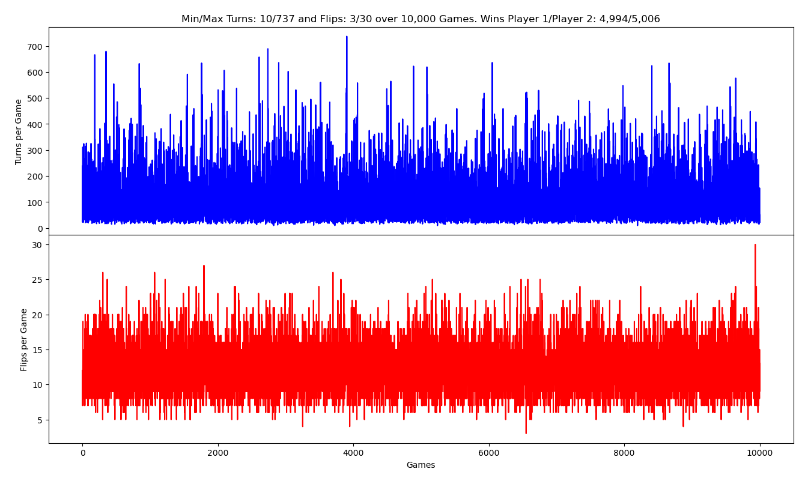

# beat-your-neighbour
Python script to simulate this 2-player card game.

This is based on:

1. The Wikipedia article:

   Beat Your Neighbour (aka Beggar my neighbour) - https://en.wikipedia.org/wiki/Beggar-my-neighbour

2. A script I wrote (byn.py) to simulate the game.

### Simulation Results
#### 1,000 Games


#### 10,000 Games


#### 100,000 Games


#### 1000,000 Games


### Help
```
$ python byn.py -h
usage: byn.py [-h] [-n GAMES] [-d] [-l LEVEL] [-q] [-s]

This program simulates a 2-player game of Beat Thy Neighbour.

optional arguments:
  -h, --help            show this help message and exit
  -n GAMES, --games GAMES
                        no of games to play
  -d, --debug           print some debugging output
  -l LEVEL, --level LEVEL
                        print debug level
  -q, --quiet           supress gameplay
  -s, --step            step through each turn
$
```

### Sample run
```
$ python byn.py
Hand1(26)
2-diamonds  5-diamonds  Q-hearts  3-diamonds  Q-spades  5-hearts  5-spades  7-clubs  A-diamonds  8-clubs  9-spades  2-spades  7-hearts
6-diamonds  6-hearts  6-spades  K-hearts  4-diamonds  K-spades  A-spades  9-diamonds  2-clubs  4-spades  10-clubs  8-diamonds  4-clubs


Hand2(26)
7-diamonds  J-hearts  Q-clubs  3-spades  J-clubs  9-clubs  8-spades  5-clubs  7-spades  10-diamonds  9-hearts  Q-diamonds  J-diamonds
3-hearts  10-spades  A-clubs  8-hearts  K-diamonds  10-hearts  3-clubs  6-clubs  K-clubs  A-hearts  J-spades  2-hearts  4-hearts


0 Player 1: 2-diamonds
Pile(1)
2-diamonds

Hand1(25)
5-diamonds  Q-hearts  3-diamonds  Q-spades  5-hearts  5-spades  7-clubs  A-diamonds  8-clubs  9-spades  2-spades  7-hearts  6-diamonds
6-hearts  6-spades  K-hearts  4-diamonds  K-spades  A-spades  9-diamonds  2-clubs  4-spades  10-clubs  8-diamonds  4-clubs

Hand2(26)
7-diamonds  J-hearts  Q-clubs  3-spades  J-clubs  9-clubs  8-spades  5-clubs  7-spades  10-diamonds  9-hearts  Q-diamonds  J-diamonds
3-hearts  10-spades  A-clubs  8-hearts  K-diamonds  10-hearts  3-clubs  6-clubs  K-clubs  A-hearts  J-spades  2-hearts  4-hearts


1 Player 2: 7-diamonds
Pile(2)
2-diamonds  7-diamonds

Hand1(25)
5-diamonds  Q-hearts  3-diamonds  Q-spades  5-hearts  5-spades  7-clubs  A-diamonds  8-clubs  9-spades  2-spades  7-hearts  6-diamonds
6-hearts  6-spades  K-hearts  4-diamonds  K-spades  A-spades  9-diamonds  2-clubs  4-spades  10-clubs  8-diamonds  4-clubs

Hand2(25)
J-hearts  Q-clubs  3-spades  J-clubs  9-clubs  8-spades  5-clubs  7-spades  10-diamonds  9-hearts  Q-diamonds  J-diamonds  3-hearts
10-spades  A-clubs  8-hearts  K-diamonds  10-hearts  3-clubs  6-clubs  K-clubs  A-hearts  J-spades  2-hearts  4-hearts

2 Player 1: 5-diamonds
Pile(3)
2-diamonds  7-diamonds  5-diamonds

Hand1(24)
Q-hearts  3-diamonds  Q-spades  5-hearts  5-spades  7-clubs  A-diamonds  8-clubs  9-spades  2-spades  7-hearts  6-diamonds  6-hearts
6-spades  K-hearts  4-diamonds  K-spades  A-spades  9-diamonds  2-clubs  4-spades  10-clubs  8-diamonds  4-clubs

Hand2(25)
J-hearts  Q-clubs  3-spades  J-clubs  9-clubs  8-spades  5-clubs  7-spades  10-diamonds  9-hearts  Q-diamonds  J-diamonds  3-hearts
10-spades  A-clubs  8-hearts  K-diamonds  10-hearts  3-clubs  6-clubs  K-clubs  A-hearts  J-spades  2-hearts  4-hearts

3 Player 2: J-hearts
Cost is 1, Player 1 paying Q-hearts
Cost is 2, Player 2 paying Q-clubs
Cost is 2, Player 1 paying 3-diamonds
Cost is 2, Player 1 paying Q-spades
Cost is 2, Player 2 paying 3-spades
Cost is 2, Player 2 paying J-clubs
Cost is 1, Player 1 paying 5-hearts
Turn winner is player 2
Hand1(20)
5-spades  7-clubs  A-diamonds  8-clubs  9-spades  2-spades  7-hearts  6-diamonds  6-hearts  6-spades  K-hearts  4-diamonds  K-spades
A-spades  9-diamonds  2-clubs  4-spades  10-clubs  8-diamonds  4-clubs

Hand2(32)
9-clubs  8-spades  5-clubs  7-spades  10-diamonds  9-hearts  Q-diamonds  J-diamonds  3-hearts  10-spades  A-clubs  8-hearts  K-diamonds
10-hearts  3-clubs  6-clubs  K-clubs  A-hearts  J-spades  2-hearts  4-hearts  2-diamonds  7-diamonds  5-diamonds  J-hearts  Q-hearts
Q-clubs  3-diamonds  Q-spades  3-spades  J-clubs  5-hearts

4 Player 2: 9-clubs
Pile(1)
9-clubs

Hand1(20)
5-spades  7-clubs  A-diamonds  8-clubs  9-spades  2-spades  7-hearts  6-diamonds  6-hearts  6-spades  K-hearts  4-diamonds  K-spades
A-spades  9-diamonds  2-clubs  4-spades  10-clubs  8-diamonds  4-clubs

Hand2(31)
8-spades  5-clubs  7-spades  10-diamonds  9-hearts  Q-diamonds  J-diamonds  3-hearts  10-spades  A-clubs  8-hearts  K-diamonds  10-hearts
3-clubs  6-clubs  K-clubs  A-hearts  J-spades  2-hearts  4-hearts  2-diamonds  7-diamonds  5-diamonds  J-hearts  Q-hearts  Q-clubs
3-diamonds  Q-spades  3-spades  J-clubs  5-hearts

5 Player 1: 5-spades
Pile(2)
9-clubs  5-spades

Hand1(19)
7-clubs  A-diamonds  8-clubs  9-spades  2-spades  7-hearts  6-diamonds  6-hearts  6-spades  K-hearts  4-diamonds  K-spades  A-spades
9-diamonds  2-clubs  4-spades  10-clubs  8-diamonds  4-clubs

Hand2(31)
8-spades  5-clubs  7-spades  10-diamonds  9-hearts  Q-diamonds  J-diamonds  3-hearts  10-spades  A-clubs  8-hearts  K-diamonds  10-hearts
3-clubs  6-clubs  K-clubs  A-hearts  J-spades  2-hearts  4-hearts  2-diamonds  7-diamonds  5-diamonds  J-hearts  Q-hearts  Q-clubs
3-diamonds  Q-spades  3-spades  J-clubs  5-hearts

6 Player 2: 8-spades
Pile(3)
9-clubs  5-spades  8-spades

Hand1(19)
7-clubs  A-diamonds  8-clubs  9-spades  2-spades  7-hearts  6-diamonds  6-hearts  6-spades  K-hearts  4-diamonds  K-spades  A-spades
9-diamonds  2-clubs  4-spades  10-clubs  8-diamonds  4-clubs

Hand2(30)
5-clubs  7-spades  10-diamonds  9-hearts  Q-diamonds  J-diamonds  3-hearts  10-spades  A-clubs  8-hearts  K-diamonds  10-hearts  3-clubs
6-clubs  K-clubs  A-hearts  J-spades  2-hearts  4-hearts  2-diamonds  7-diamonds  5-diamonds  J-hearts  Q-hearts  Q-clubs  3-diamonds
Q-spades  3-spades  J-clubs  5-hearts

7 Player 1: 7-clubs
Pile(4)
9-clubs  5-spades  8-spades  7-clubs

Hand1(18)
A-diamonds  8-clubs  9-spades  2-spades  7-hearts  6-diamonds  6-hearts  6-spades  K-hearts  4-diamonds  K-spades  A-spades  9-diamonds
2-clubs  4-spades  10-clubs  8-diamonds  4-clubs

Hand2(30)
5-clubs  7-spades  10-diamonds  9-hearts  Q-diamonds  J-diamonds  3-hearts  10-spades  A-clubs  8-hearts  K-diamonds  10-hearts  3-clubs
6-clubs  K-clubs  A-hearts  J-spades  2-hearts  4-hearts  2-diamonds  7-diamonds  5-diamonds  J-hearts  Q-hearts  Q-clubs  3-diamonds
Q-spades  3-spades  J-clubs  5-hearts

8 Player 2: 5-clubs
Pile(5)
9-clubs  5-spades  8-spades  7-clubs  5-clubs

Hand1(18)
A-diamonds  8-clubs  9-spades  2-spades  7-hearts  6-diamonds  6-hearts  6-spades  K-hearts  4-diamonds  K-spades  A-spades  9-diamonds
2-clubs  4-spades  10-clubs  8-diamonds  4-clubs

Hand2(29)
7-spades  10-diamonds  9-hearts  Q-diamonds  J-diamonds  3-hearts  10-spades  A-clubs  8-hearts  K-diamonds  10-hearts  3-clubs  6-clubs
K-clubs  A-hearts  J-spades  2-hearts  4-hearts  2-diamonds  7-diamonds  5-diamonds  J-hearts  Q-hearts  Q-clubs  3-diamonds  Q-spades
3-spades  J-clubs  5-hearts

9 Player 1: A-diamonds
Cost is 4, Player 2 paying 7-spades
Cost is 4, Player 2 paying 10-diamonds
Cost is 4, Player 2 paying 9-hearts
Cost is 4, Player 2 paying Q-diamonds
Cost is 2, Player 1 paying 8-clubs
Cost is 2, Player 1 paying 9-spades
Turn winner is player 2
Hand1(15)
2-spades  7-hearts  6-diamonds  6-hearts  6-spades  K-hearts  4-diamonds  K-spades  A-spades  9-diamonds  2-clubs  4-spades  10-clubs
8-diamonds  4-clubs

Hand2(37)
J-diamonds  3-hearts  10-spades  A-clubs  8-hearts  K-diamonds  10-hearts  3-clubs  6-clubs  K-clubs  A-hearts  J-spades  2-hearts
4-hearts  2-diamonds  7-diamonds  5-diamonds  J-hearts  Q-hearts  Q-clubs  3-diamonds  Q-spades  3-spades  J-clubs  5-hearts  9-clubs
5-spades  8-spades  7-clubs  5-clubs  A-diamonds  7-spades  10-diamonds  9-hearts  Q-diamonds  8-clubs  9-spades

10 Player 2: J-diamonds
Cost is 1, Player 1 paying 2-spades
Turn winner is player 2
Hand1(14)
7-hearts  6-diamonds  6-hearts  6-spades  K-hearts  4-diamonds  K-spades  A-spades  9-diamonds  2-clubs  4-spades  10-clubs  8-diamonds
4-clubs

Hand2(38)
3-hearts  10-spades  A-clubs  8-hearts  K-diamonds  10-hearts  3-clubs  6-clubs  K-clubs  A-hearts  J-spades  2-hearts  4-hearts
2-diamonds  7-diamonds  5-diamonds  J-hearts  Q-hearts  Q-clubs  3-diamonds  Q-spades  3-spades  J-clubs  5-hearts  9-clubs  5-spades
8-spades  7-clubs  5-clubs  A-diamonds  7-spades  10-diamonds  9-hearts  Q-diamonds  8-clubs  9-spades  J-diamonds  2-spades

11 Player 2: 3-hearts
Pile(1)
3-hearts

Hand1(14)
7-hearts  6-diamonds  6-hearts  6-spades  K-hearts  4-diamonds  K-spades  A-spades  9-diamonds  2-clubs  4-spades  10-clubs  8-diamonds
4-clubs

Hand2(37)
10-spades  A-clubs  8-hearts  K-diamonds  10-hearts  3-clubs  6-clubs  K-clubs  A-hearts  J-spades  2-hearts  4-hearts  2-diamonds
7-diamonds  5-diamonds  J-hearts  Q-hearts  Q-clubs  3-diamonds  Q-spades  3-spades  J-clubs  5-hearts  9-clubs  5-spades  8-spades
7-clubs  5-clubs  A-diamonds  7-spades  10-diamonds  9-hearts  Q-diamonds  8-clubs  9-spades  J-diamonds  2-spades

12 Player 1: 7-hearts
Pile(2)
3-hearts  7-hearts

Hand1(13)
6-diamonds  6-hearts  6-spades  K-hearts  4-diamonds  K-spades  A-spades  9-diamonds  2-clubs  4-spades  10-clubs  8-diamonds  4-clubs


Hand2(37)
10-spades  A-clubs  8-hearts  K-diamonds  10-hearts  3-clubs  6-clubs  K-clubs  A-hearts  J-spades  2-hearts  4-hearts  2-diamonds
7-diamonds  5-diamonds  J-hearts  Q-hearts  Q-clubs  3-diamonds  Q-spades  3-spades  J-clubs  5-hearts  9-clubs  5-spades  8-spades
7-clubs  5-clubs  A-diamonds  7-spades  10-diamonds  9-hearts  Q-diamonds  8-clubs  9-spades  J-diamonds  2-spades

13 Player 2: 10-spades
Pile(3)
3-hearts  7-hearts  10-spades

Hand1(13)
6-diamonds  6-hearts  6-spades  K-hearts  4-diamonds  K-spades  A-spades  9-diamonds  2-clubs  4-spades  10-clubs  8-diamonds  4-clubs


Hand2(36)
A-clubs  8-hearts  K-diamonds  10-hearts  3-clubs  6-clubs  K-clubs  A-hearts  J-spades  2-hearts  4-hearts  2-diamonds  7-diamonds
5-diamonds  J-hearts  Q-hearts  Q-clubs  3-diamonds  Q-spades  3-spades  J-clubs  5-hearts  9-clubs  5-spades  8-spades  7-clubs
5-clubs  A-diamonds  7-spades  10-diamonds  9-hearts  Q-diamonds  8-clubs  9-spades  J-diamonds  2-spades

14 Player 1: 6-diamonds
Pile(4)
3-hearts  7-hearts  10-spades  6-diamonds

Hand1(12)
6-hearts  6-spades  K-hearts  4-diamonds  K-spades  A-spades  9-diamonds  2-clubs  4-spades  10-clubs  8-diamonds  4-clubs

Hand2(36)
A-clubs  8-hearts  K-diamonds  10-hearts  3-clubs  6-clubs  K-clubs  A-hearts  J-spades  2-hearts  4-hearts  2-diamonds  7-diamonds
5-diamonds  J-hearts  Q-hearts  Q-clubs  3-diamonds  Q-spades  3-spades  J-clubs  5-hearts  9-clubs  5-spades  8-spades  7-clubs
5-clubs  A-diamonds  7-spades  10-diamonds  9-hearts  Q-diamonds  8-clubs  9-spades  J-diamonds  2-spades

15 Player 2: A-clubs
Cost is 4, Player 1 paying 6-hearts
Cost is 4, Player 1 paying 6-spades
Cost is 4, Player 1 paying K-hearts
Cost is 3, Player 2 paying 8-hearts
Cost is 3, Player 2 paying K-diamonds
Cost is 3, Player 1 paying 4-diamonds
Cost is 3, Player 1 paying K-spades
Cost is 3, Player 2 paying 10-hearts
Cost is 3, Player 2 paying 3-clubs
Cost is 3, Player 2 paying 6-clubs
Turn winner is player 1
Hand1(22)
A-spades  9-diamonds  2-clubs  4-spades  10-clubs  8-diamonds  4-clubs  3-hearts  7-hearts  10-spades  6-diamonds  A-clubs  6-hearts
6-spades  K-hearts  8-hearts  K-diamonds  4-diamonds  K-spades  10-hearts  3-clubs  6-clubs

Hand2(30)
K-clubs  A-hearts  J-spades  2-hearts  4-hearts  2-diamonds  7-diamonds  5-diamonds  J-hearts  Q-hearts  Q-clubs  3-diamonds  Q-spades
3-spades  J-clubs  5-hearts  9-clubs  5-spades  8-spades  7-clubs  5-clubs  A-diamonds  7-spades  10-diamonds  9-hearts  Q-diamonds
8-clubs  9-spades  J-diamonds  2-spades

16 Player 1: A-spades
Cost is 4, Player 2 paying K-clubs
Cost is 3, Player 1 paying 9-diamonds
Cost is 3, Player 1 paying 2-clubs
Cost is 3, Player 1 paying 4-spades
Turn winner is player 2
Hand1(18)
10-clubs  8-diamonds  4-clubs  3-hearts  7-hearts  10-spades  6-diamonds  A-clubs  6-hearts  6-spades  K-hearts  8-hearts  K-diamonds
4-diamonds  K-spades  10-hearts  3-clubs  6-clubs

Hand2(34)
A-hearts  J-spades  2-hearts  4-hearts  2-diamonds  7-diamonds  5-diamonds  J-hearts  Q-hearts  Q-clubs  3-diamonds  Q-spades  3-spades
J-clubs  5-hearts  9-clubs  5-spades  8-spades  7-clubs  5-clubs  A-diamonds  7-spades  10-diamonds  9-hearts  Q-diamonds  8-clubs
9-spades  J-diamonds  2-spades  A-spades  K-clubs  9-diamonds  2-clubs  4-spades

17 Player 2: A-hearts
Cost is 4, Player 1 paying 10-clubs
Cost is 4, Player 1 paying 8-diamonds
Cost is 4, Player 1 paying 4-clubs
Cost is 4, Player 1 paying 3-hearts
Turn winner is player 2
Hand1(14)
7-hearts  10-spades  6-diamonds  A-clubs  6-hearts  6-spades  K-hearts  8-hearts  K-diamonds  4-diamonds  K-spades  10-hearts  3-clubs
6-clubs

Hand2(38)
J-spades  2-hearts  4-hearts  2-diamonds  7-diamonds  5-diamonds  J-hearts  Q-hearts  Q-clubs  3-diamonds  Q-spades  3-spades  J-clubs
5-hearts  9-clubs  5-spades  8-spades  7-clubs  5-clubs  A-diamonds  7-spades  10-diamonds  9-hearts  Q-diamonds  8-clubs  9-spades
J-diamonds  2-spades  A-spades  K-clubs  9-diamonds  2-clubs  4-spades  A-hearts  10-clubs  8-diamonds  4-clubs  3-hearts

18 Player 2: J-spades
Cost is 1, Player 1 paying 7-hearts
Turn winner is player 2
Hand1(13)
10-spades  6-diamonds  A-clubs  6-hearts  6-spades  K-hearts  8-hearts  K-diamonds  4-diamonds  K-spades  10-hearts  3-clubs  6-clubs


Hand2(39)
2-hearts  4-hearts  2-diamonds  7-diamonds  5-diamonds  J-hearts  Q-hearts  Q-clubs  3-diamonds  Q-spades  3-spades  J-clubs  5-hearts
9-clubs  5-spades  8-spades  7-clubs  5-clubs  A-diamonds  7-spades  10-diamonds  9-hearts  Q-diamonds  8-clubs  9-spades  J-diamonds
2-spades  A-spades  K-clubs  9-diamonds  2-clubs  4-spades  A-hearts  10-clubs  8-diamonds  4-clubs  3-hearts  J-spades  7-hearts


19 Player 2: 2-hearts
Pile(1)
2-hearts

Hand1(13)
10-spades  6-diamonds  A-clubs  6-hearts  6-spades  K-hearts  8-hearts  K-diamonds  4-diamonds  K-spades  10-hearts  3-clubs  6-clubs


Hand2(38)
4-hearts  2-diamonds  7-diamonds  5-diamonds  J-hearts  Q-hearts  Q-clubs  3-diamonds  Q-spades  3-spades  J-clubs  5-hearts  9-clubs
5-spades  8-spades  7-clubs  5-clubs  A-diamonds  7-spades  10-diamonds  9-hearts  Q-diamonds  8-clubs  9-spades  J-diamonds  2-spades
A-spades  K-clubs  9-diamonds  2-clubs  4-spades  A-hearts  10-clubs  8-diamonds  4-clubs  3-hearts  J-spades  7-hearts

20 Player 1: 10-spades
Pile(2)
2-hearts  10-spades

Hand1(12)
6-diamonds  A-clubs  6-hearts  6-spades  K-hearts  8-hearts  K-diamonds  4-diamonds  K-spades  10-hearts  3-clubs  6-clubs

Hand2(38)
4-hearts  2-diamonds  7-diamonds  5-diamonds  J-hearts  Q-hearts  Q-clubs  3-diamonds  Q-spades  3-spades  J-clubs  5-hearts  9-clubs
5-spades  8-spades  7-clubs  5-clubs  A-diamonds  7-spades  10-diamonds  9-hearts  Q-diamonds  8-clubs  9-spades  J-diamonds  2-spades
A-spades  K-clubs  9-diamonds  2-clubs  4-spades  A-hearts  10-clubs  8-diamonds  4-clubs  3-hearts  J-spades  7-hearts

21 Player 2: 4-hearts
Pile(3)
2-hearts  10-spades  4-hearts

Hand1(12)
6-diamonds  A-clubs  6-hearts  6-spades  K-hearts  8-hearts  K-diamonds  4-diamonds  K-spades  10-hearts  3-clubs  6-clubs

Hand2(37)
2-diamonds  7-diamonds  5-diamonds  J-hearts  Q-hearts  Q-clubs  3-diamonds  Q-spades  3-spades  J-clubs  5-hearts  9-clubs  5-spades
8-spades  7-clubs  5-clubs  A-diamonds  7-spades  10-diamonds  9-hearts  Q-diamonds  8-clubs  9-spades  J-diamonds  2-spades  A-spades
K-clubs  9-diamonds  2-clubs  4-spades  A-hearts  10-clubs  8-diamonds  4-clubs  3-hearts  J-spades  7-hearts

22 Player 1: 6-diamonds
Pile(4)
2-hearts  10-spades  4-hearts  6-diamonds

Hand1(11)
A-clubs  6-hearts  6-spades  K-hearts  8-hearts  K-diamonds  4-diamonds  K-spades  10-hearts  3-clubs  6-clubs

Hand2(37)
2-diamonds  7-diamonds  5-diamonds  J-hearts  Q-hearts  Q-clubs  3-diamonds  Q-spades  3-spades  J-clubs  5-hearts  9-clubs  5-spades
8-spades  7-clubs  5-clubs  A-diamonds  7-spades  10-diamonds  9-hearts  Q-diamonds  8-clubs  9-spades  J-diamonds  2-spades  A-spades
K-clubs  9-diamonds  2-clubs  4-spades  A-hearts  10-clubs  8-diamonds  4-clubs  3-hearts  J-spades  7-hearts

23 Player 2: 2-diamonds
Pile(5)
2-hearts  10-spades  4-hearts  6-diamonds  2-diamonds

Hand1(11)
A-clubs  6-hearts  6-spades  K-hearts  8-hearts  K-diamonds  4-diamonds  K-spades  10-hearts  3-clubs  6-clubs

Hand2(36)
7-diamonds  5-diamonds  J-hearts  Q-hearts  Q-clubs  3-diamonds  Q-spades  3-spades  J-clubs  5-hearts  9-clubs  5-spades  8-spades
7-clubs  5-clubs  A-diamonds  7-spades  10-diamonds  9-hearts  Q-diamonds  8-clubs  9-spades  J-diamonds  2-spades  A-spades  K-clubs
9-diamonds  2-clubs  4-spades  A-hearts  10-clubs  8-diamonds  4-clubs  3-hearts  J-spades  7-hearts

24 Player 1: A-clubs
Cost is 4, Player 2 paying 7-diamonds
Cost is 4, Player 2 paying 5-diamonds
Cost is 4, Player 2 paying J-hearts
Cost is 1, Player 1 paying 6-hearts
Turn winner is player 2
Hand1(9)
6-spades  K-hearts  8-hearts  K-diamonds  4-diamonds  K-spades  10-hearts  3-clubs  6-clubs

Hand2(43)
Q-hearts  Q-clubs  3-diamonds  Q-spades  3-spades  J-clubs  5-hearts  9-clubs  5-spades  8-spades  7-clubs  5-clubs  A-diamonds
7-spades  10-diamonds  9-hearts  Q-diamonds  8-clubs  9-spades  J-diamonds  2-spades  A-spades  K-clubs  9-diamonds  2-clubs  4-spades
A-hearts  10-clubs  8-diamonds  4-clubs  3-hearts  J-spades  7-hearts  2-hearts  10-spades  4-hearts  6-diamonds  2-diamonds  A-clubs
7-diamonds  5-diamonds  J-hearts  6-hearts

25 Player 2: Q-hearts
Cost is 2, Player 1 paying 6-spades
Cost is 2, Player 1 paying K-hearts
Cost is 3, Player 2 paying Q-clubs
Cost is 2, Player 1 paying 8-hearts
Cost is 2, Player 1 paying K-diamonds
Cost is 3, Player 2 paying 3-diamonds
Cost is 3, Player 2 paying Q-spades
Cost is 2, Player 1 paying 4-diamonds
Cost is 2, Player 1 paying K-spades
Cost is 3, Player 2 paying 3-spades
Cost is 3, Player 2 paying J-clubs
Cost is 1, Player 1 paying 10-hearts
Turn winner is player 2
Hand1(2)
3-clubs  6-clubs

Hand2(50)
5-hearts  9-clubs  5-spades  8-spades  7-clubs  5-clubs  A-diamonds  7-spades  10-diamonds  9-hearts  Q-diamonds  8-clubs  9-spades
J-diamonds  2-spades  A-spades  K-clubs  9-diamonds  2-clubs  4-spades  A-hearts  10-clubs  8-diamonds  4-clubs  3-hearts  J-spades
7-hearts  2-hearts  10-spades  4-hearts  6-diamonds  2-diamonds  A-clubs  7-diamonds  5-diamonds  J-hearts  6-hearts  Q-hearts  6-spades
K-hearts  Q-clubs  8-hearts  K-diamonds  3-diamonds  Q-spades  4-diamonds  K-spades  3-spades  J-clubs  10-hearts

26 Player 2: 5-hearts
Pile(1)
5-hearts

Hand1(2)
3-clubs  6-clubs

Hand2(49)
9-clubs  5-spades  8-spades  7-clubs  5-clubs  A-diamonds  7-spades  10-diamonds  9-hearts  Q-diamonds  8-clubs  9-spades  J-diamonds
2-spades  A-spades  K-clubs  9-diamonds  2-clubs  4-spades  A-hearts  10-clubs  8-diamonds  4-clubs  3-hearts  J-spades  7-hearts
2-hearts  10-spades  4-hearts  6-diamonds  2-diamonds  A-clubs  7-diamonds  5-diamonds  J-hearts  6-hearts  Q-hearts  6-spades  K-hearts  
Q-clubs  8-hearts  K-diamonds  3-diamonds  Q-spades  4-diamonds  K-spades  3-spades  J-clubs  10-hearts

27 Player 1: 3-clubs
Pile(2)
5-hearts  3-clubs

Hand1(1)
6-clubs

Hand2(49)
9-clubs  5-spades  8-spades  7-clubs  5-clubs  A-diamonds  7-spades  10-diamonds  9-hearts  Q-diamonds  8-clubs  9-spades  J-diamonds
2-spades  A-spades  K-clubs  9-diamonds  2-clubs  4-spades  A-hearts  10-clubs  8-diamonds  4-clubs  3-hearts  J-spades  7-hearts
2-hearts  10-spades  4-hearts  6-diamonds  2-diamonds  A-clubs  7-diamonds  5-diamonds  J-hearts  6-hearts  Q-hearts  6-spades  K-hearts
Q-clubs  8-hearts  K-diamonds  3-diamonds  Q-spades  4-diamonds  K-spades  3-spades  J-clubs  10-hearts

28 Player 2: 9-clubs
Pile(3)
5-hearts  3-clubs  9-clubs

Hand1(1)
6-clubs

Hand2(48)
5-spades  8-spades  7-clubs  5-clubs  A-diamonds  7-spades  10-diamonds  9-hearts  Q-diamonds  8-clubs  9-spades  J-diamonds  2-spades
A-spades  K-clubs  9-diamonds  2-clubs  4-spades  A-hearts  10-clubs  8-diamonds  4-clubs  3-hearts  J-spades  7-hearts  2-hearts
10-spades  4-hearts  6-diamonds  2-diamonds  A-clubs  7-diamonds  5-diamonds  J-hearts  6-hearts  Q-hearts  6-spades  K-hearts  Q-clubs
8-hearts  K-diamonds  3-diamonds  Q-spades  4-diamonds  K-spades  3-spades  J-clubs  10-hearts

29 Player 1: 6-clubs
Pile(4)
5-hearts  3-clubs  9-clubs  6-clubs

Hand1(0)


Hand2(48)
5-spades  8-spades  7-clubs  5-clubs  A-diamonds  7-spades  10-diamonds  9-hearts  Q-diamonds  8-clubs  9-spades  J-diamonds  2-spades
A-spades  K-clubs  9-diamonds  2-clubs  4-spades  A-hearts  10-clubs  8-diamonds  4-clubs  3-hearts  J-spades  7-hearts  2-hearts
10-spades  4-hearts  6-diamonds  2-diamonds  A-clubs  7-diamonds  5-diamonds  J-hearts  6-hearts  Q-hearts  6-spades  K-hearts  Q-clubs
8-hearts  K-diamonds  3-diamonds  Q-spades  4-diamonds  K-spades  3-spades  J-clubs  10-hearts

Game over! Winner is player 2
Pile(4)
5-hearts  3-clubs  9-clubs  6-clubs

Hand1(0)


Hand2(48)
5-spades  8-spades  7-clubs  5-clubs  A-diamonds  7-spades  10-diamonds  9-hearts  Q-diamonds  8-clubs  9-spades  J-diamonds  2-spades
A-spades  K-clubs  9-diamonds  2-clubs  4-spades  A-hearts  10-clubs  8-diamonds  4-clubs  3-hearts  J-spades  7-hearts  2-hearts
10-spades  4-hearts  6-diamonds  2-diamonds  A-clubs  7-diamonds  5-diamonds  J-hearts  6-hearts  Q-hearts  6-spades  K-hearts  Q-clubs
8-hearts  K-diamonds  3-diamonds  Q-spades  4-diamonds  K-spades  3-spades  J-clubs  10-hearts

30 turns, longest penalty run 12
$
```
